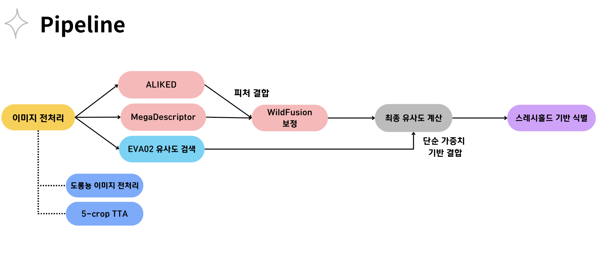

# 🐾 BiTAmin Wild Animal Re-Identification



---

## 📌 프로젝트 개요

**BiTAmin CV Project**는 다양한 동물 종(시라소니, 바다거북, 도롱뇽 등)의 개체를 식별하는 **야생동물 재식별 (Re-ID)** 문제를 해결하기 위한 프로젝트입니다.  

본 시스템은 **CVPR 2025 - FGVC10 Workshop**에서 개최된 **AnimalCLEF25 / LifeCLEF Wild Animal Re-Identification Challenge**에 출전하기 위해 개발되었습니다.

고유한 개체 식별을 위해 **복수의 글로벌 및 로컬 디스크립터**를 활용하고, 이를 **Feature Fusion + Calibration + Thresholding** 방식으로 통합하여 최종 예측을 수행합니다.

### 프로젝트 기간
2025.03.12 ~ 2025.05.28

---

## 🚀 파이프라인 개요

이 프로젝트는 다음과 같은 단계로 구성됩니다:

### 1. 이미지 전처리
- 도롱뇽 이미지 전용 Orientation 정규화 전략
- 5-Crop TTA (Test-Time Augmentation)

### 2. Feature 추출
- **MegaDescriptor**: 전역(Global) 임베딩 추출
- **ALIKED**: 국소(Local) keypoint 기반 유사도 추출
- **EVA02**: 사전학습된 글로벌 디스크립터 (CLIP 기반)

### 3. Feature Fusion
- Mega + ALIKED 결과를 **WildFusion 보정 모듈**로 통합
- WildFusion은 calibration을 기반으로 score를 정규화

### 4. 최종 유사도 계산
- WildFusion 유사도와 EVA02 cosine similarity를 **단순 가중합**으로 결합
- 향후 Fusion MLP로 확장 가능

### 5. 개체 식별
- **스레시홀드 기반 이진 분류**:
  - 유사도가 일정 기준 이상이면 기존 개체
  - 이하면 `"new_individual"`로 판단

---

## 💡 주요 특징

| 기술 구성                | 설명 |
|------------------------|------|
| `MegaDescriptor`       | Timm 기반 글로벌 feature 추출 |
| `ALIKED`               | 로컬 keypoint matcher |
| `WildFusion`           | 두 matcher 결합 후 보정 (calibration) |
| `EVA02`                | CLIP 계열 대규모 사전학습 비전 모델 |
| `Rerank Cascade`       | Top-k 후보 재정렬을 통한 정밀 예측 향상 |
| `Species별 전략 적용` | 도롱뇽 등 특수 상황에서 별도 처리 적용 |

---

## 📁 프로젝트 구조

```bash
bitamin_cv_proj/
│
├── main.py                  # 메인 실행 파일
├── config.py                # 설정 상수
├── sample_submission.csv    # 제출용 예측 결과
│
├── src/
│   ├── dataset.py           # 데이터 로딩 및 샘플링
│   ├── matcher.py           # Mega, ALIKED, EVA02 matcher 구성
│   ├── fusion.py            # WildFusion 모듈
│   ├── fusion_head.py       # Fusion MLP 정의
│   ├── transforms.py        # 전처리 및 TTA 전략
│   └── utils.py             # 기타 유틸리티 함수
│
├── assets/
│   └── pipeline.png         # 파이프라인 시각화 이미지
