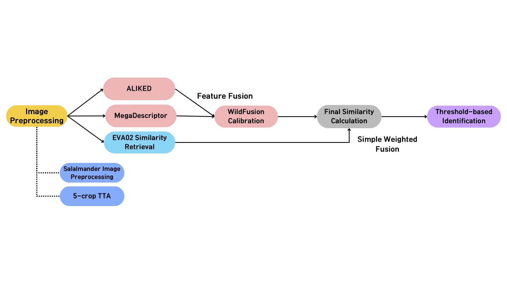

# 🐾 Wild Animal Re-Identification

You can find the full paper about this project [here](https://ceur-ws.org/Vol-4038/paper_245.pdf).



---

## 📌 Project Overview

This project aims to address the problem of **wild animal re-identification (Re-ID)** across various species such as lynx, sea turtles, and salamanders.

This system was developed to participate in the **AnimalCLEF25 / LifeCLEF Wild Animal Re-Identification Challenge**, part of the **CVPR 2025 - FGVC10 Workshop.**

To identify individuals accurately, the system leverages multiple global and local descriptors, combining them through **Feature Fusion + Calibration + Thresholding** to generate final predictions.

### Project Duration
March 12, 2025 - May 28, 2025

---

## 🚀 Pipeline Overview

This project consists of the following stages:

### 1. Image Preprocessing
- Orientation normalization tailored for salamander images
- 5-Crop Test-Time Augmentation (TTA)

### 2. Feature Extraction
- **MegaDescriptor**: Extracts global embeddings
- **ALIKED**: Local keypoint-based similarity
- **EVA02**: Pretrained global descriptor based on CLIP

### 3. Feature Fusion
- Combines MegaD and ALIKED outputs using the WildFusion calibration module
- WildFusion normalizes scores via calibration

### 4. Final Similarity Computation
- Combines WildFusion similarity and EVA02 cosine similarity using weighted sum
- Can be extended with a Fusion MLP in the future

### 5. Individual Identification
- **Threshold-based binary classification**:
  - Above threshold → existing individual
  - Below threshold → classified as `new_individual`

---

## 💡 Key Features

| **component**                | **Description** |
|------------------------|------|
| `MegaDescriptor`       | Global feature extractor using Timm |
| `ALIKED`               | Local keypoint matcher |
| `WildFusion`           | Fusion and calibration of two matchers |
| `EVA02`                | Large-scale pretrained vision model (CLIP-based) |
| `Rerank Cascade`       | Improves accuracy via top-k candidate reranking |
| `Species-specific Strategy`| Custom handling for special cases (e.g., salamanders) |

---

## 📁 Project Structure

```bash
AnimalCLEF2025/
│
├── main.py                  # Main entry point
├── config.py                # Configuration constants
├── sample_submission.csv    # Final predictions for submission
│
├── src/
│   ├── dataset.py           # Dataset loading and sampling
│   ├── matcher.py           # Mega, ALIKED, EVA02 matcher definitions
│   ├── fusion.py            # WildFusion module
│   ├── fusion_head.py       # Fusion MLP head
│   ├── transforms.py        # Preprocessing and TTA strategies
│   └── utils.py             # Utility functions
│
├── assets/
│   └── pipeline.png         # Pipeline diagram
```

---

## 🔧 How to Run

1. Install dependencies:

```bash
pip install -r requirements.txt
```

2. Set up Kaggle API (download `kaggle.json` from [your Kaggle account settings](https://www.kaggle.com/settings) and place it in `~/.kaggle/`):

```bash
mkdir -p ~/.kaggle
mv ~/Downloads/kaggle.json ~/.kaggle/
chmod 600 ~/.kaggle/kaggle.json
```

3. Run the main script:

```bash
python main.py
```
